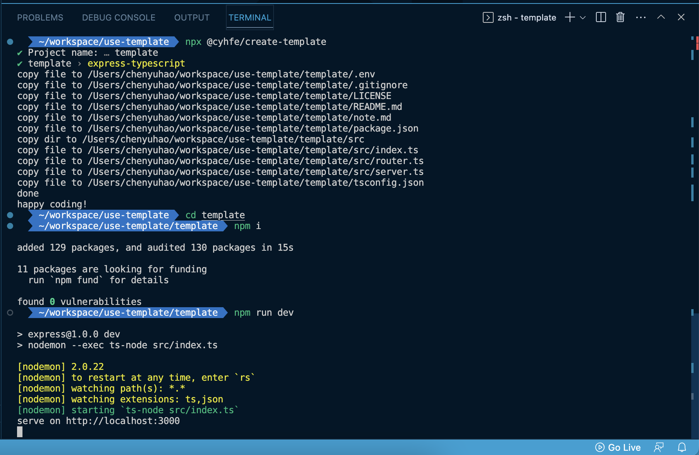

# @cyhfe/create-template

[![npm version][npm-version-src]][npm-version-href]
[![npm downloads][npm-downloads-src]][npm-downloads-href]

Personal Starter Template

- [x] webpack-react-typescript
- [x] webpack-react-typescript-emotion
- [ ] webpack-react-typescript-tailwind
- [x] express-typescript

[webpack config](./assets/webpack-config.md)

[express config](./assets/express.md)

## Usage

```sh
npx @cyhfe/create-template

npm create @cyhfe/template
```



## License

Published under [MIT License](./LICENSE).

<!-- Badges -->

[npm-version-src]: https://img.shields.io/npm/v/@cyhfe/create-template?style=flat&colorA=18181B&colorB=F0DB4F
[npm-version-href]: https://npmjs.com/package/@cyhfe/create-template
[npm-downloads-src]: https://img.shields.io/npm/dm/@cyhfe/create-template?style=flat&colorA=18181B&colorB=F0DB4F
[npm-downloads-href]: https://npmjs.com/package/@cyhfe/create-template
