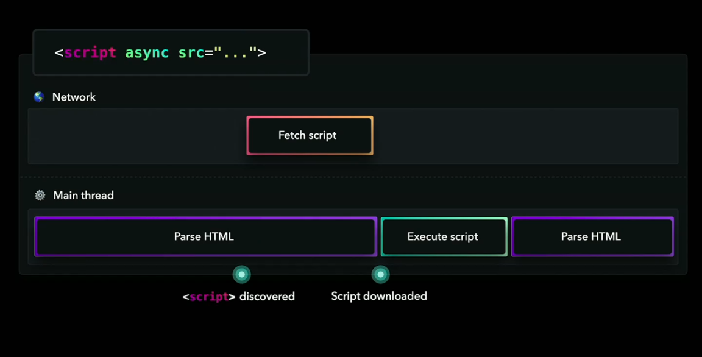
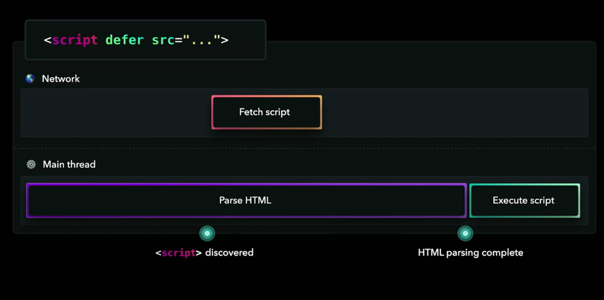

# webpack-template

参考 `create-react-app` 和官方文档,先完成一个 React + TS 的最小可用版本.

观察各种配置前后产物差异.

后续通过使用慢慢优化.

- [x] webpack merge
- [x] [contenthash] => 长期缓存
- [x] `node-module`提取到单独的 vendor chunk 文件中 => 长期缓存
- [x] css 提取压缩

```ts
// todo
```

## defer

index.html 中的 script 会被加上 defer 属性

区别:





## 代码分离

1. 多入口
2. 防止重复
3. 动态导入

```js
{
  optimization: {
    // 将 runtime 代码拆分为一个单独的 chunk。将其设置为 single 来为所有 chunk 创建一个 runtime bundle：
    runtimeChunk: "single",
    //将第三方库(library)（例如 lodash 或 react）提取到单独的 vendor chunk 文件中，是比较推荐的做法，这是因为，它们很少像本地的源代码那样频繁修改。因此通过实现以上步骤，利用 client 的长效缓存机制，命中缓存来消除请求，并减少向 server 获取资源，同时还能保证 client 代码和 server 代码版本一致。
    moduleIds: "deterministic",
    splitChunks: {
      cacheGroups: {
        vendor: {
          test: /[\\/]node_modules[\\/]/,
          name: "vendors",
          chunks: "all",
        },
      },
    },
  },
}
```

## prefetch preload

prefetch(预获取)：将来某些导航下可能需要的资源
preload(预加载)：当前导航下可能需要资源

preload chunk 会在父 chunk 加载时，以并行方式开始加载。prefetch chunk 会在父 chunk 加载结束后开始加载。
preload chunk 具有中等优先级，并立即下载。prefetch chunk 在浏览器闲置时下载。
preload chunk 会在父 chunk 中立即请求，用于当下时刻。prefetch chunk 会用于未来的某个时刻。

```
import(/* webpackPreload: true */ 'ChartingLibrary');

```

## tree shaking

mode: production 默认启用

标记方法

- `usedExports: true`

- 通过`pakage.json` 的`sideEffects: false`
- 注释 `/*#__PURE__*/`

## 类型声明文件

直接`import png`, ts 报错.需要声明文件

```ts
// react-app-env.d.ts
declare module "*.png" {
  const src: string;
  export default src;
}
```

## 分离及清除未使用的 css

```js
const path = require("path");
const glob = require("glob");
const MiniCssExtractPlugin = require("mini-css-extract-plugin");
const PurgeCSSPlugin = require("purgecss-webpack-plugin");

const PATHS = {
  src: path.join(__dirname, "src"),
};

module.exports = {
  entry: "./src/index.js",
  output: {
    filename: "bundle.js",
    path: path.join(__dirname, "dist"),
  },
  optimization: {
    splitChunks: {
      cacheGroups: {
        styles: {
          name: "styles",
          test: /\.css$/,
          chunks: "all",
          enforce: true,
        },
      },
    },
  },
  module: {
    rules: [
      {
        test: /\.css$/,
        use: [MiniCssExtractPlugin.loader, "css-loader"],
      },
    ],
  },
  plugins: [
    new MiniCssExtractPlugin({
      filename: "[name].css",
    }),
    new PurgeCSSPlugin({
      paths: glob.sync(`${PATHS.src}/**/*`, { nodir: true }),
    }),
  ],
};
```
